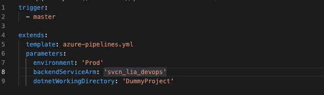
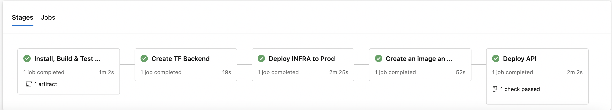

## Description
This pipeline help you to the dockerize a C# project, build an infrastructure on Azure and deploy your API to Azure App Service.

## How To Use
There is four required variables on main pipeline;

- template: Main orchestration file

- environment: The environment you are building. Prod, Test, QA etc.

- backendServiceArm: Azure service connection

- dotnetWorkingDirectory: Your C# project's directory. If you are using sub directories you have to specify it.(i.e 'dotnetdirectory/sampleproject')

## Template Files and Stages
There is 6 template files and 5 stages on this pipeline.
- azure-pipelines.yml: Main orchestration file to manage template files and define variables.

- template-dotnet.yml: The goal with this template is build, test and publish your .NET project. This stage creates a artifact of your published API files.

- template-terraform-backend.yml: This template file helps you to the constitute backend for your terrafom activities by creating a storage account for terraform stage files and a storage container on Azure.

- template-terraform-stages.yml: This is the main terraform stage which is building the infrastructure on Azure(App Service, App Serice Plan, Application Insights, Container Registry)

- template-docker.yml: This stages creates a docker container image of published API artifact and pushes to the Azure Container Registry.

- template-deploy.yml: This is the last stage of pipeline. If everything goes acording to the plan, the stage is require a approval and then starts to deploy API to App Service.

Sample view of complete pipeline;

